AI Workforce Analytics Using Business Intelligence and Machine Learning

Authors

Manar Turke

202111286

Supervised by

Dr Ayman Mansour

Course: 307498 - Graduation Project

Second Semester, 2025/2026

---

Contents

[Abstract]

[Acknowledgement](#_Toc230656767)

[Business Intelligence Project Description and Objectives](#_Toc230656768)

[Data Research and Acquiring Effort](#_Toc230656769)

[Data Description and Understanding](#_Toc230656770)

[Data Dictionary](#_Toc230656771)

[Exploratory Data Analysis (EDA)](#_Toc230656772)

[Data Primary Cleaning and Transformation](#_Toc230656773)

[Data Visualization and Insights](#_Toc230656774)

[Descriptive Statistics](#_Toc230656775)

[Column Distributions](#_Toc230656776)

[Heatmap](#_Toc230656777)

[Pivot Tables](#_Toc230656778)

[Charts](#_Toc230656779)

[Advanced Analytics and AI Modeling](#_Toc230656780)

[Supervised Models](#_Toc230656781)

[Unsupervised Models](#_Toc230656782)

[Prediction](#_Toc230656783)

[Logistic Regression](#_Toc230656784)

[Random Forest](#_Toc230656785)

[Clustering](#_Toc230656786)

[Tools Research and Selection Effort](#_Toc230656787)

[Project Deployment Effort - Use Case](#_Toc230656788)

[Results](#_Toc230656789)

[References](#_Toc230656790)

---

# Abstract

This project investigates the application of Business Intelligence, data analytics, and machine learning techniques to analyze the impact of Artificial Intelligence on the modern workforce. The study aims to support data-driven decision-making by identifying the factors affecting employee burnout, productivity, satisfaction, attrition risk, and fear of AI replacement across different industries and job roles. The project focuses on analyzing employee demographics, company characteristics, AI adoption stages, remote work environments, and workplace performance indicators to uncover behavioral and organizational patterns related to AI transformation.

The implementation phase involved data cleaning, preprocessing, transformation, and exploration data analysis using Python and Google Colab. Interactive dashboards were developed in Microsoft Power BI to visualize employee burnout levels, productivity trends, AI fear distribution, attrition risk, job role analysis, and industry performance indicators. Predictive analytics were conducted using Logistic Regression and Random Forest classification models in Python and Google Colab to predict employee attrition risk based on workplace and AI-related factors. Model performance was evaluated using classification metrics including accuracy, precision, recall, F1-score, ROC Curve, AUC Score, and confusion matrix analysis. In addition, clustering techniques were applied to segment employees into distinct workforce groups based on burnout, satisfaction, productivity, and AI-related perceptions.

The results demonstrate that the predictive models achieved strong classification performance, with the Random Forest model outperforming Logistic Regression by capturing complex relationships between workforce variables. Analysis revealed that burnout level, employee satisfaction, AI replacement perception, work environment, and productivity were among the most influential factors affecting attrition risk. Furthermore, clustering analysis identified meaningful workforce segments such as highly productive employees, high-burnout employees, and employees with elevated AI replacement concerns, enabling organizations to improve workforce planning and employee support strategies. Overall, the integration of descriptive analytics, predictive modeling, clustering, and business intelligence dashboards within a unified framework proved effective in delivering actionable insights, enhancing organizational decision-making, improving employee well-being, and supporting workforce adaptation during AI-driven transformation.

---

# Acknowledgement 

First and foremost, I would like to thank Allah for giving me the strength, patience, and determination to successfully complete this project and overcome all challenges throughout this journey.

I would like to express my sincere gratitude to my professor and academic supervisor for their invaluable guidance, continuous support, and constructive feedback throughout the development of this project. Their expertise and encouragement played a significant role in improving the quality of this work and enhancing my knowledge in the fields of Business Intelligence, Data Analytics, and Machine Learning.

I would also like to extend my deepest appreciation to my family and friends for their constant encouragement, patience, motivation, and emotional support during every stage of this project. Their support gave me the confidence and determination to continue working toward achieving my goals.

Special thanks are also extended to the faculty and staff members whose dedication to academic excellence created a supportive learning environment that encouraged learning, innovation, critical thinking, and practical application of analytical skills.

Finally, I would like to thank everyone who contributed directly or indirectly to the success of this project. Your support and encouragement have had a meaningful impact on both my academic and personal growth.

---

# Business Intelligence Project Description and Objectives

Project Description and Goal

This project focuses on applying Business Intelligence, data analytics, and machine learning techniques to analyze the impact of Artificial Intelligence on the modern workforce. The project aims to transform workforce data into meaningful insights through descriptive analytics, predictive modeling, and clustering techniques.

The study analyzes employee demographics, job roles, industries, AI adoption stages, productivity, burnout, satisfaction, remote work environments, and attrition risk to better understand the factors affecting employee well-being and workforce stability in AI-driven workplaces. Using Python, Google Colab, and Microsoft Power BI, the project demonstrates how data-driven approaches can support organizations in improving workforce management and strategic decision-making.

Interactive dashboards, predictive models, and clustering techniques were implemented to provide intelligent insights related to employee behavior, workplace performance, and AI transformation.

Project Objectives

- Analyze workforce data to identify patterns affecting burnout, productivity, satisfaction, and attrition risk.
- Develop Logistic Regression and Random Forest models to predict employee attrition risk.
- Identify the key factors influencing employee well-being, such as burnout, AI fear, productivity, and remote work type.
- Apply clustering techniques to segment employees into workforce groups based on behavioral and performance patterns.
- Design interactive Microsoft Power BI dashboards to support data-driven decision-making and workforce management.

---

# Data Research and Acquiring Effort

Bottom of Form

The data used in this project was obtained from a publicly available dataset on [Kaggle](https://www.kaggle.com?utm_source=chatgpt.com) and focuses on workforce analytics and the impact of Artificial Intelligence on employees and organizations. The primary objective during the data acquisition phase was to obtain data that accurately represents employee behavior, workplace performance, AI adoption, productivity, burnout, satisfaction, and attrition risk.

The selected dataset contains detailed information about employee demographics, job roles, industries, company sizes, AI adoption stages, remote work environments, productivity scores, burnout levels, employee satisfaction, salary, and AI replacement concerns. The dataset was selected because it provides comprehensive information required for descriptive analytics, predictive modeling, clustering analysis, and business intelligence dashboard development.

The dataset was imported into Python, Google Colab, and Microsoft Power BI for data cleaning, preprocessing, transformation, visualization, and machine learning implementation. Several preprocessing steps were performed to handle missing values, encode categorical variables, and improve data quality for analysis and predictive modeling.

The use of workforce analytics data enabled a comprehensive analysis of employee behavior and workplace performance through descriptive analytics, predictive modeling, and clustering techniques. This supports the development of data-driven workforce strategies that can help organizations improve employee well-being, reduce attrition risk, understand the impact of AI adoption, and support strategic decision-making in AI-driven workplaces.

---

# Data Description and Understanding

## Data Dictionary
The dataset used in this project contains workforce, employee, and organizational information related to the impact of Artificial Intelligence on the modern workplace. The dataset consists of employee records used to analyze productivity, burnout, satisfaction, AI adoption, and attrition risk across different industries and job roles.

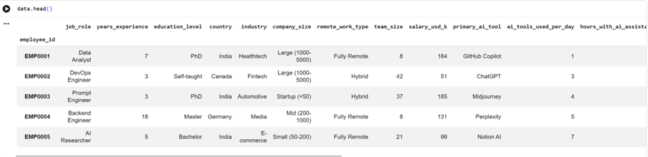

| Column Name       | Description                                           | Type        | Use                                                                           |
| ----------------- | ----------------------------------------------------- | ----------- | ----------------------------------------------------------------------------- |
| Employee_ID       | Unique identifier for each employee                   | Categorical | Used to uniquely identify employee records                                    |
| Age               | Age of the employee                                   | Numerical   | Helps analyze workforce demographics and age-related trends                   |
| Gender            | Gender of the employee                                | Categorical | Used for demographic and diversity analysis                                   |
| Industry          | Industry in which the employee works                  | Categorical | Helps compare AI impact across industries                                     |
| Job_Role          | Employee job position or occupation                   | Categorical | Used to analyze role-based AI impact and attrition risk                       |
| Company_Size      | Size category of the company                          | Categorical | Used to compare organizational workforce behavior                             |
| AI_Adoption_Stage | Current stage of AI implementation within the company | Categorical | Helps analyze AI maturity and workforce readiness                             |
| AI_Fear           | Employee concern about AI replacement                 | Numerical   | Used to measure AI-related fear and workplace perception                      |
| Burnout           | Employee burnout score or level                       | Numerical   | Used to evaluate employee well-being and stress levels                        |
| Productivity      | Employee productivity score                           | Numerical   | Used to analyze workforce performance and efficiency                          |
| Satisfaction      | Employee satisfaction score                           | Numerical   | Helps evaluate employee engagement and workplace satisfaction                 |
| Salary            | Employee salary or income level                       | Numerical   | Used for financial and workforce analysis                                     |
| Remote_Work_Type  | Employee work environment (Remote, Hybrid, Onsite)    | Categorical | Used to analyze the impact of work style on employees                         |
| Country           | Country of employment                                 | Categorical | Supports geographic and regional workforce analysis                           |
| Attrition_Risk    | Employee turnover or leaving risk level               | Categorical | Target variable used for predictive modeling and workforce stability analysis |

---

# Exploratory Data Analysis (EDA)

Initial Exploratory Data Analysis (EDA) was performed to understand the structure, distribution, and behavioral patterns of the workforce dataset before applying predictive and clustering models. Various charts, visualizations, and statistical summaries were used to uncover patterns, trends, and anomalies related to employee burnout, productivity, satisfaction, AI fear, and attrition risk.

Histograms and descriptive statistics were applied to numerical variables such as Age, Salary, Burnout, Productivity, Satisfaction, and AI Fear scores. The analysis showed variations in employee well-being and workplace performance across different employee groups. Box plots for burnout and productivity revealed the presence of outliers, indicating employees with unusually high burnout levels or exceptionally high productivity scores.

Bar charts and pivot tables were used to analyze categorical variables such as Industry, Job Role, Company Size, AI Adoption Stage, Remote Work Type, and Attrition Risk. The analysis showed that some industries and job roles experience higher burnout and attrition risk levels compared to others. AI adoption analysis also revealed differences in workforce behavior and employee perception across organizations with different AI maturity levels.

Scatter plots between Burnout and Satisfaction demonstrated a negative relationship, indicating that employees with higher burnout levels tend to report lower satisfaction scores. Additional analysis between AI Fear and Attrition Risk suggested that employees with higher concerns regarding AI replacement are more likely to experience higher attrition risk.

Overall, the EDA phase provided valuable workforce insights, identified employee behavior patterns and high-risk workforce groups, and guided feature selection for predictive modeling and clustering analysis. These findings directly support the project's objective of improving workforce management, understanding the impact of AI transformation, reducing attrition risk, and enabling data-driven decision-making through Business Intelligence and machine learning techniques.

---

# Data Primary Cleaning and Transformation

Data cleaning and preprocessing were performed to prepare the employee AI workplace dataset for analysis, visualization, clustering, and predictive modeling. The main objective was to improve data quality, ensure consistency, and prepare the data for machine learning and business intelligence analysis.

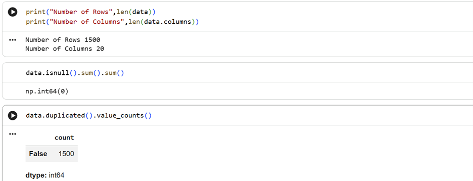
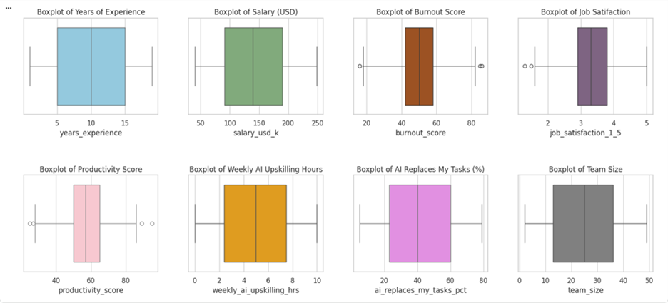
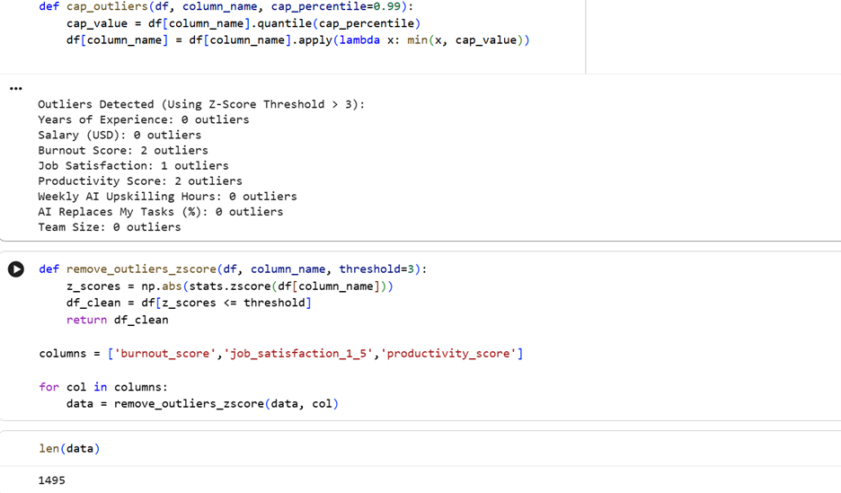

Main Cleaning Steps

- Checked missing values and duplicate records; no major issues were found.
- Converted numerical and categorical columns into appropriate data types.
- Used boxplots and Z-Score analysis to detect outliers in variables such as Burnout Score, Productivity Score, and Job Satisfaction.
- Treated detected outliers using filtering and capping techniques.
- Selected important features related to AI adoption, burnout, productivity, salary, satisfaction, and attrition risk.
- Encoded categorical variables to prepare the data for machine learning models.

Purpose

These preprocessing steps improved data quality and ensured the dataset was ready for exploration analysis, machine learning models, clustering, and interactive Power BI dashboards to support data-driven workforce analysis and decision-making.

---

# Data Visualization and Insights

## Descriptive Statistics

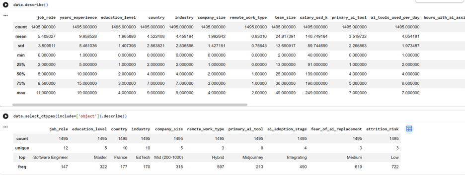

Numerical Variables (data.describe())

The first table summarizes the numerical columns in the dataset using statistical measures such as:

- Count: Shows the number of records in each column. Most columns contain 1495 records, indicating consistent data availability.
- Mean: Represents the average value. For example:
  - Average years of experience is approximately 10 years.
  - Average salary is around 140K USD.
  - Average team size is about 25 employees.
- Standard Deviation (std): Measures how spread out the values are from the average. Higher values indicate greater variation among employees.
- Minimum and Maximum Values: Show the lowest and highest values recorded in each column. For example:
  - Salary ranges from 40K to 249K USD.
  - Team size ranges from 2 to 49 employees.

- Percentiles (25%, 50%, 75%): Help understand the distribution of the data.
  - The median (50%) years of experience is 10 years.
  - 75% of employees earn below approximately 190K USD.

This analysis provides insights into employee experience, salary distribution, AI tool usage, and workforce characteristics.

Categorical Variables (data.select_dtypes(include=\['object'\]).describe())

The second table summarizes categorical columns such as Job Role, Country, Industry, and AI Adoption Stage.

Key statistics include:

- Unique: Shows the number of unique categories in each column.
  - There are 12 job roles, 10 countries, and 10 industries in the dataset.
- Top: Indicates the most frequent category.
  - The most common job role is Software Engineer.
  - The most common work type is Hybrid.
  - The most common AI adoption stage is Integrating.
- Frequency (freq): Shows how many times the top category appears.
  - Hybrid work appears 597 times.
  - Medium fear of AI replacement appears 619 times.

Purpose

Descriptive statistics help identify data distributions, dominant categories, and potential patterns in the dataset. These insights support exploratory data analysis, feature selection, machine learning preparation, and business intelligence dashboard development.

---

## Column Distributions

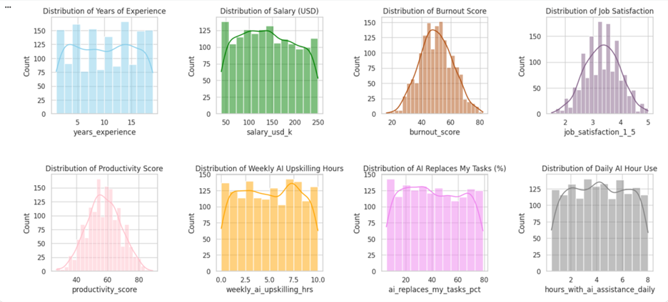

1\. Years of Experience

Distribution: Experience levels are fairly spread across employees with slight concentration in mid-level experience.  
Business Use: Helps analyze how experience affects productivity, burnout, and AI adoption.  
Contribution: Supports workforce performance and attrition analysis.

2\. Salary (USD)

Distribution: Salaries are distributed across different income levels, mostly between medium and high ranges.  
Business Use: Helps evaluate compensation patterns and employee satisfaction.  
Contribution: Supports analysis of salary impact on burnout and productivity.

3\. Burnout Score

Distribution: Burnout scores follow a near-normal distribution centered around moderate burnout levels.  
Business Use: Helps monitor employee stress and workplace well-being.  
Contribution: Supports analysis of burnout impact on satisfaction and attrition risk.

4\. Job Satisfaction

Distribution: Most employees show medium to high satisfaction levels.  
Business Use: Measures employee engagement and morale.  
Contribution: Helps analyze workplace satisfaction related to AI adoption.

5\. Productivity Score

Distribution: Productivity scores are concentrated around average performance levels.  
Business Use: Evaluates workforce performance trends.  
Contribution: Supports analysis of productivity factors such as burnout and AI use.

6\. Weekly AI Upskilling Hours

Distribution: Employees spend weekly hours learning AI skills.  
Business Use: Measures employee readiness for AI transformation.  
Contribution: Supports analysis of AI learning behavior.

7\. AI Replaces My Tasks (%)

Distribution: Employee opinions vary regarding how much AI can replace their tasks.  
Business Use: Helps understand employee concerns about automation.  
Contribution: Supports analysis of AI fear and workplace perception.

8\. Daily AI Hour Use

Distribution: AI usage hours are fairly distributed across employees.  
Business Use: Evaluates employee dependence on AI tools.  
Contribution: Supports analysis of AI usage impact on productivity and work behavior.

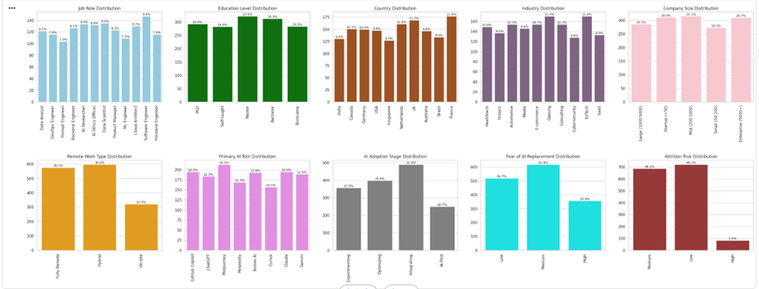

1\. Job Role Distribution

Distribution: Software Engineer has the highest percentage, while some technical roles appear slightly lower.  
Business Use: Helps analyze workforce structure across AI-related jobs.  
Contribution: Supports comparison of burnout, productivity, and AI fear between job roles.

2\. Education Level Distribution

Distribution: Most employees hold Master's or Bachelor's degrees.  
Business Use: Helps evaluate workforce qualification levels.  
Contribution: Supports analysis of education impact on AI adoption and productivity.

3\. Country Distribution

Distribution: Employees are distributed across multiple countries, with France and the UK slightly higher.  
Business Use: Enables geographic workforce analysis.  
Contribution: Helps compare employee behavior across regions.

4\. Industry Distribution

Distribution: Gaming and EdTech industries have higher representation.  
Business Use: Identifies industries more engaged in AI transformation.  
Contribution: Supports industry-level AI and productivity analysis.

5\. Company Size Distribution

Distribution: Mid-size and Enterprise companies appear most represented.  
Business Use: Helps compare AI adoption across company sizes.  
Contribution: Supports analysis of organizational AI readiness.

6\. Remote Work Type Distribution

Distribution: Hybrid and Fully Remote work dominate the dataset.  
Business Use: Evaluates the effect of work style on employees.  
Contribution: Helps study AI fear and satisfaction across work environments.

7\. Primary AI Tool Distribution

Distribution: Midjourney and GitHub Copilot are among the most used tools.  
Business Use: Identifies commonly adopted AI technologies.  
Contribution: Supports analysis of AI tool usage and productivity.

8\. AI Adoption Stage Distribution

Distribution: Most companies are in the Integrating stage.  
Business Use: Measures AI implementation maturity.  
Contribution: Shows organizational progress in AI transformation.

9\. Fear of AI Replacement Distribution

Distribution: Medium fear is the most common level among employees.  
Business Use: Helps organizations measure employee AI concerns.  
Contribution: Supports analysis of AI fear and workplace well-being.

10\. Attrition Risk Distribution

Distribution: Most employees fall under Low or Medium attrition risk.  
Business Use: Helps evaluate workforce retention stability.  
Contribution: Supports predictive analysis of employee turnover risk.

---

## Heatmap

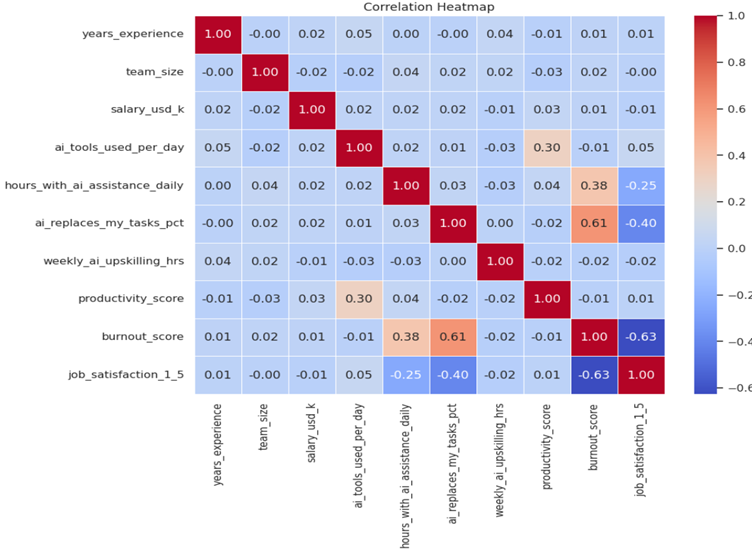

The heatmap shows the relationships between numerical variables in the dataset. Values closer to 1 indicate strong positive relationships, while values closer to -1 indicate strong negative relationships.

Key Findings

- Burnout Score and Job Satisfaction (-0.63): Higher burnout is associated with lower job satisfaction.
- AI Replaces My Tasks (%) and Burnout Score (0.61): Employees who feel AI replaces more of their tasks tend to experience higher burnout.
- AI Replaces My Tasks (%) and Job Satisfaction (-0.40): Greater AI replacement concern is linked to lower satisfaction.
- AI Tools Used Per Day and Productivity Score (0.30): Using more AI tools is moderately associated with higher productivity.

Contribution to the Study

The correlation analysis helps explain how AI usage, burnout, productivity, and job satisfaction are connected, supporting the study's objective of understanding AI's impact on employees and workplace performance.

---

## Pivot Tables

1\. Average Salary by Job Role and Attrition Risk

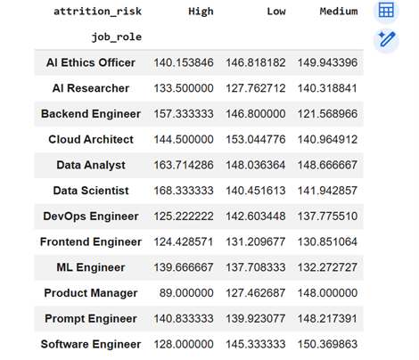

The pivot table compares the average salary across job roles based on attrition risk levels (High, Medium, Low). Results show that some technical roles such as Data Scientist and Data Analyst have relatively higher salaries even among employees with high attrition risk.

Business Use: Helps organizations understand whether salary differences influence employee attrition and retention across job roles.

2\. Job Role by Attrition Risk Count

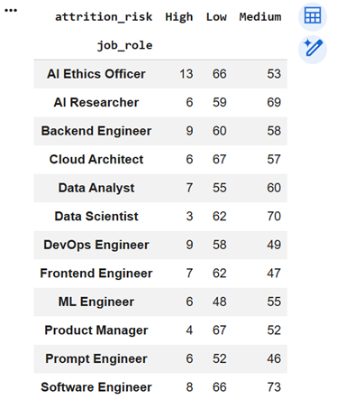

This pivot table shows the number of employees in each attrition risk category for every job role. Most job roles contain a higher number of Low and Medium attrition risk employees, while High attrition risk employees represent a smaller portion.

Business Use: Supports HR departments in identifying job roles that may require retention strategies or employee engagement improvements.

3\. Fear of AI Replacement by Attrition Risk

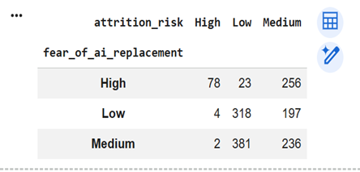

The table analyzes the relationship between fear of AI replacement and employee attrition risk. Employees with high fear of AI replacement show noticeably higher Medium and High attrition risk levels compared to employees with low fear levels.

Business Use: Helps organizations evaluate how employee concerns about AI adoption may affect workforce stability, satisfaction, and turnover risk.

4\. Job Satisfaction by Attrition Risk

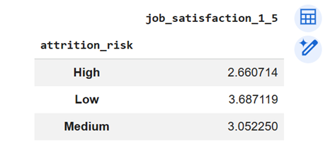

The pivot table shows the average job satisfaction score for each attrition risk level. Employees with Low attrition risk have the highest satisfaction score (3.69), while employees with High attrition risk have the lowest satisfaction score (2.66).

Business Use: Shows that lower job satisfaction is associated with higher employee attrition risk, helping organizations improve employee engagement and retention strategies.

5\. Burnout Score by Attrition Risk

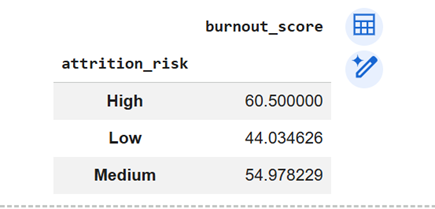

This table compares the average burnout score across attrition risk levels. Employees with High attrition risk have the highest burnout score (60.5), while employees with Low attrition risk have the lowest burnout score (44.03).

Business Use: Helps organizations understand the relationship between burnout and employee turnover risk, supporting workplace well-being initiatives.

---

## Charts

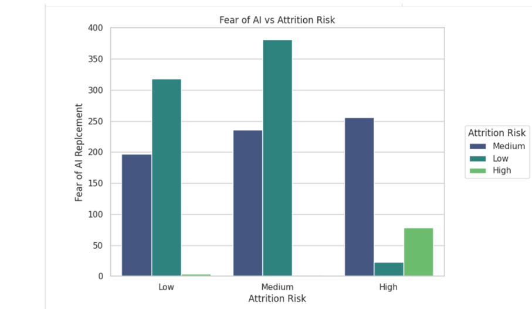

Description: The chart shows that employees with higher fear of AI replacement tend to have higher attrition risk, while employees with lower fear mostly have low attrition risk.

Business Use: Help organizations understand how AI concerns affect employee retention and support better AI training and communication strategies.

Contribution: Supports the study by showing the relationship between AI adoption concerns and employee turnover risk, improving data-driven HR decision-making.

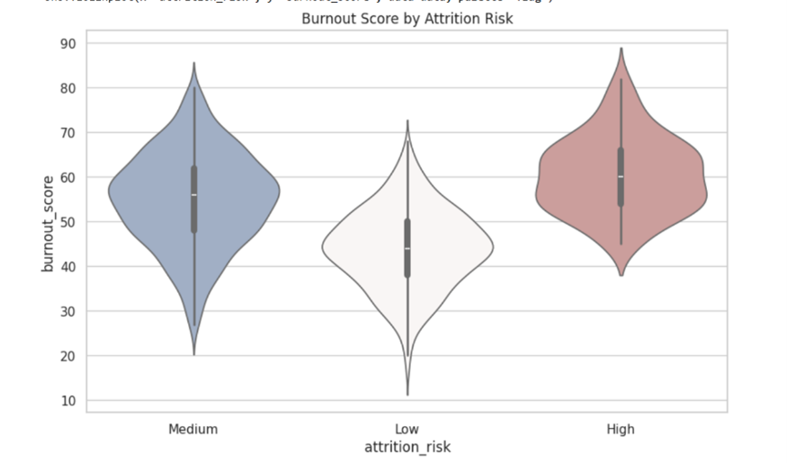

Description: The violin plot shows the distribution of burnout scores across attrition risk levels. Employees with high attrition risk have the highest burnout scores, while low attrition risk employees show lower burnout levels.

Business Use: Help organizations identify how burnout contributes to employee turnover risk and supports employee wellbeing initiatives.

Contribution : Supports the study by demonstrating the strong relationship between burnout and attrition risk in AI-driven workplaces.

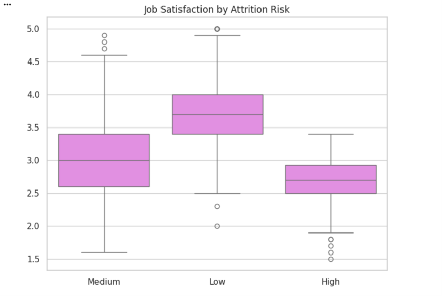

Description: The boxplot shows that employees with low attrition risk have the highest job satisfaction levels, while employees with high attrition risk have the lowest satisfaction scores.

Business Use: Helps organizations understand how employee satisfaction impacts retention and supports strategies to improve engagement and workplace experience.

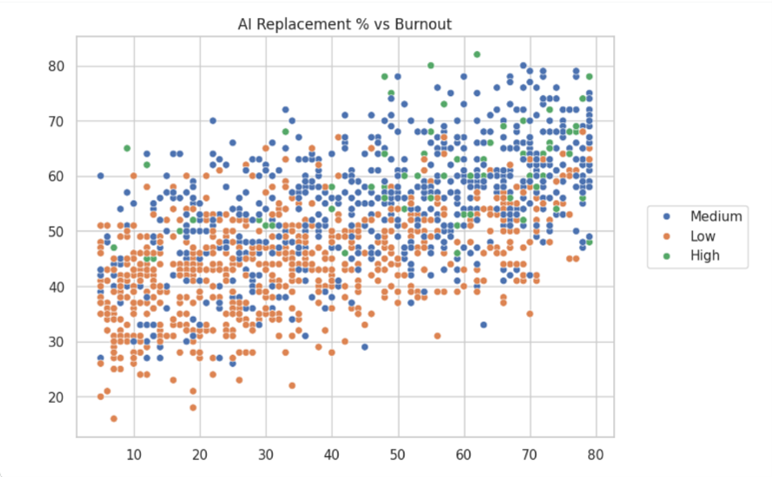

Description: The scatter plot shows a positive relationship between AI replacement percentage and burnout score. Employees who feel that AI replaces more of their tasks tend to experience higher burnout levels. High attrition risk employees are concentrated in the higher burnout area.

Business Use: Help organizations monitor the impact of AI adoption on employee wellbeing and identify employees at higher risk of stress and turnover.

Contribution: Supports the study by demonstrating how AI-related job replacement concerns are associated with increased burnout and employee attrition risk.

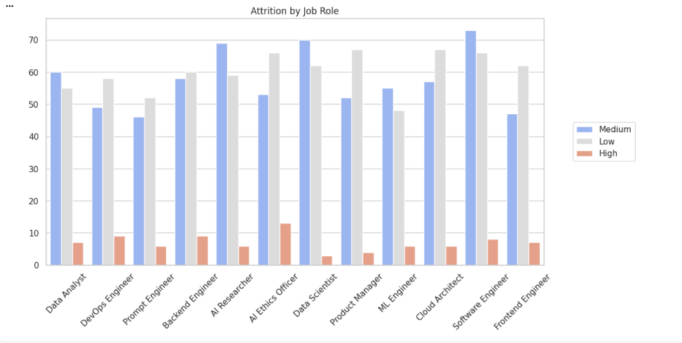

Description: The bar chart compares attrition risk levels across different job roles. Most job roles show higher counts in low and medium attrition risk categories, while high attrition risk remains relatively low across all roles.

Business Use: Help organizations identify which job roles are more vulnerable to employee turnover and support targeted retention and workforce planning strategies.

Contribution: Supports the study by highlighting how attrition risk differs across AI-related job roles, helping improve employee retention analysis and HR decision-making.

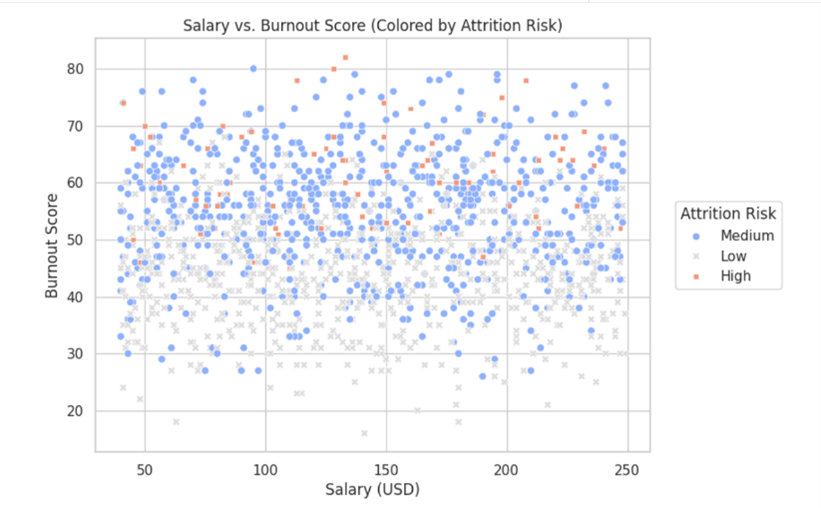

Description: The scatter plot shows the relationship between salary and burnout score across different attrition risk levels. Burnout levels remain high for many employees regardless of salary, especially among medium and high attrition risk groups.

Business Use: Help organizations understand that higher salaries alone may not reduce employee burnout, supporting better wellbeing and retention strategies.

Contribution: Supports the study by showing that burnout is influenced by factors beyond salary and is strongly connected to employee attrition risk.

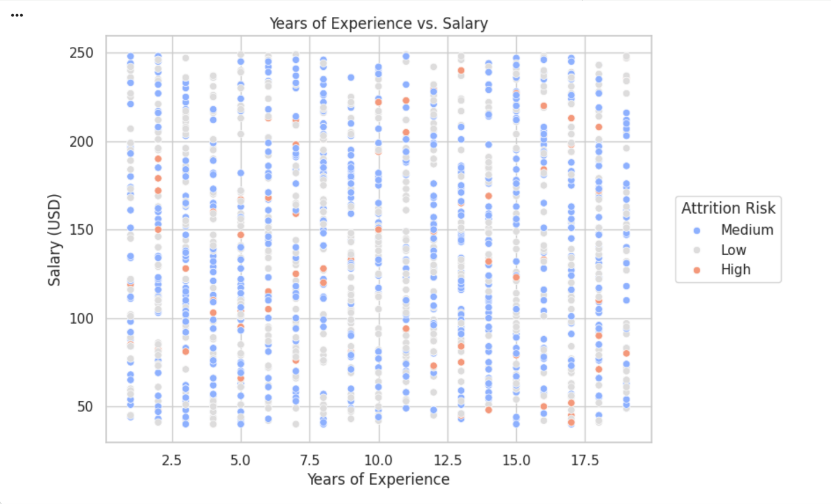

Description: The scatter plot shows the relationship between years of experience and salary across different attrition risk levels. Salaries generally vary across all experience levels, with medium attrition risk employees appearing most frequently.

Business Use: Help organizations analyze salary patterns by experience level and identify whether compensation aligns with employee retention.

Contribution: Supports the study by showing how experience and salary relate to attrition risk, helping evaluate workforce stability and employee retention factors.

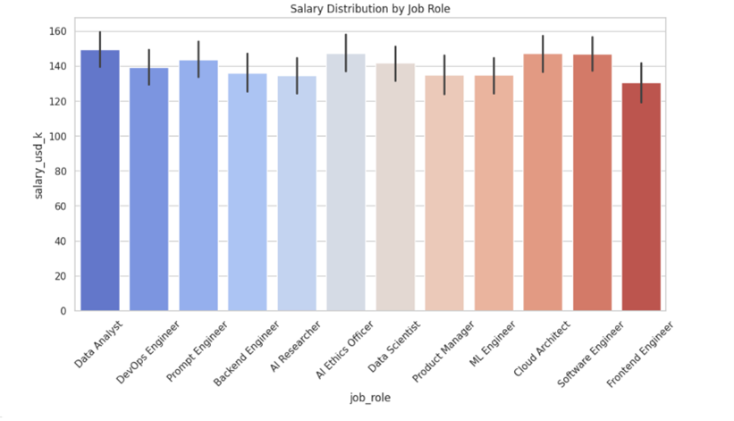

Description: The bar chart compares average salary levels across different job roles. Roles such as Data Analyst, Cloud Architect, Software Engineer, and AI Ethics Officer show higher average salaries, while Frontend Engineer and Product Manager have relatively lower averages.

Business Use: Help organizations evaluate salary competitiveness across roles and improve compensation planning and talent retention.

Contribution: Supports the study by showing salary differences among AI-related job roles and their impact on workforce management and employee satisfaction.

---

## Dashboard Design & Business Insights

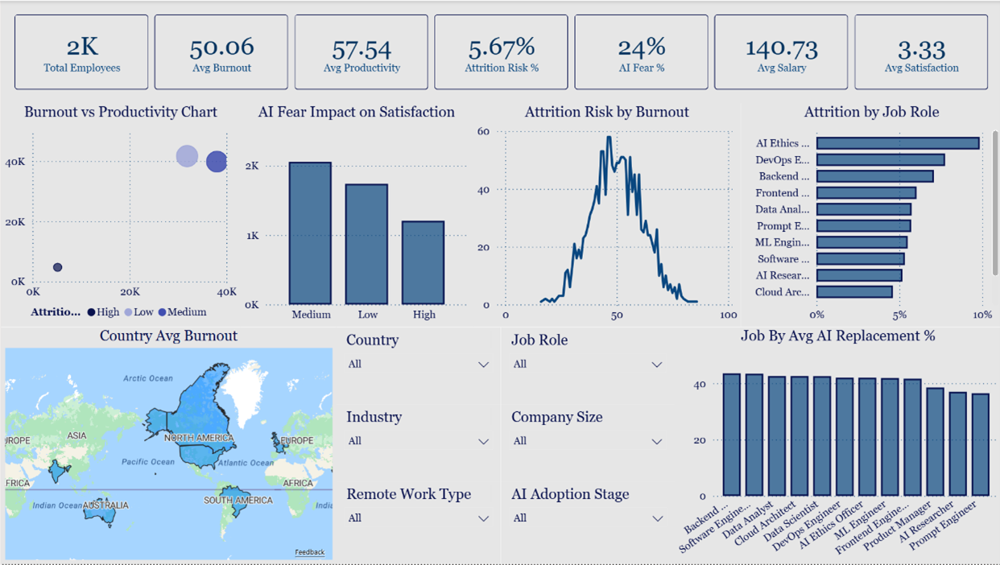

Employee Attrition & AI Impact Dashboard

Dashboard Purpose

This dashboard analyzes employee burnout, productivity, AI fear, satisfaction, salary, and attrition risk across different job roles, countries, and work environments. It helps organizations identify workforce challenges, measure AI-related concerns, and support employee retention strategies.

KPI Cards

Displays key workforce indicators including total employees, average burnout, productivity, attrition risk, AI fear percentage, salary, and satisfaction level.  
Business Use: Provides a quick overview of workforce performance and employee wellbeing to support strategic HR decision-making.

Burnout vs Productivity Chart (Bubble Chart)

Shows the relationship between employee burnout and productivity across attrition risk categories.  
Business Use: Helps identify whether higher burnout impacts productivity and supports workforce performance monitoring.

AI Fear Impact on Satisfaction (Bar Chart)

Compare employee satisfaction levels based on different AI fear categories.  
Business Use: Helps organizations understand how fear of AI adoption affects employee morale and job satisfaction.

Attrition Risk by Burnout (Line Chart)

Displays how attrition risk changes with increasing burnout levels.  
Business Use: Helps HR teams identify burnout thresholds associated with higher employee turnover risk.

Attrition by Job Role (Bar Chart)

Shows attrition risk distribution across different job roles.  
Business Use: Helps identify job positions with higher turnover risk to improve retention planning and employee support.

Country Average Burnout (Map Visualization)

Displays average burnout levels across countries.  
Business Use: Supports regional workforce analysis and helps organizations identify locations requiring wellbeing improvements.

Job Role by Average AI Replacement % (Bar Chart)

Shows the average perceived AI replacement percentage for each job role.  
Business Use: Helps organizations understand which roles are most concerned about AI replacement and supports workforce planning.

Filters / Slicers

Includes filters for country, industry, job role, company size, remote work type, and AI adoption stage.  
Business Use: Allows detailed and customized analysis across different workforce segments to support HR and business decisions.

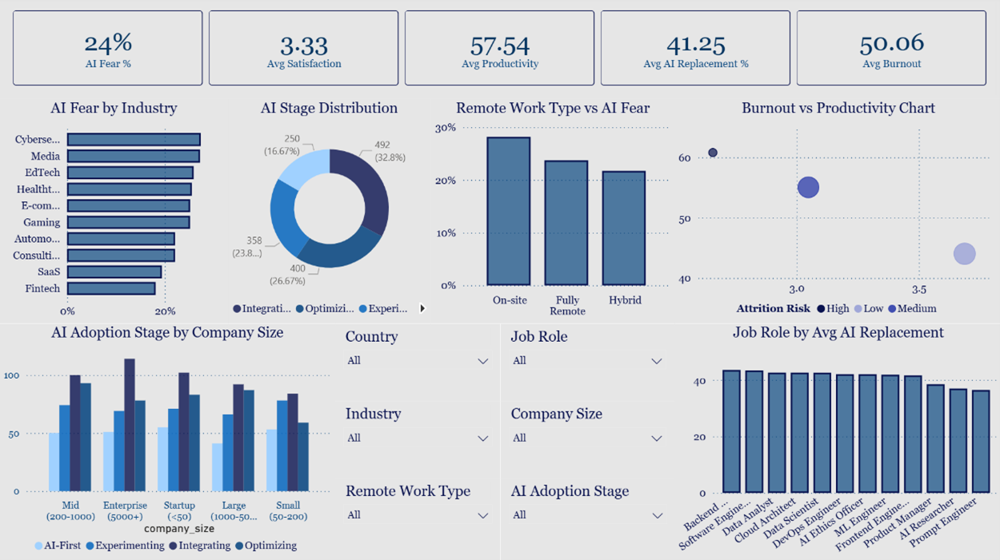

AI Workforce Analytics Dashboard

Dashboard Purpose

This dashboard analyzes the impact of AI adoption on employees across industries, job roles, company sizes, and work environments. It focuses on burnout, productivity, job satisfaction, AI fear, and attrition risk to support workforce planning and business decision-making.

KPI Cards

AI Fear %

Shows the percentage of employees who fear AI replacing their jobs.  
Business Use: Helps organizations understand employee concerns about automation and workforce uncertainty.

Avg Satisfaction

Displays the average employee job satisfaction score.  
Business Use: Helps monitor employee engagement and workplace satisfaction levels.

Avg Productivity

Shows the average productivity score of employees.  
Business Use: Helps evaluate workforce performance and efficiency after AI adoption.

Avg AI Replacement %

Represents the average percentage of tasks employees believe AI can replace.  
Business Use: Helps organizations understand the perceived impact of automation on jobs.

Avg Burnout

Displays the average employee burnout score.  
Business Use: Helps identify stress levels and support employee wellbeing strategies.

AI Fear by Industry (Bar Chart)

Shows AI fear percentages across industries such as Cybersecurity, Media, and Healthcare.  
Business Use: Helps organizations identify industries where employees are more concerned about AI replacement and supports change management planning.

AI Stage Distribution (Donut Chart)

Displays the distribution of AI adoption stages such as Integrating, Optimizing, and Experimenting.  
Business Use: Helps businesses measure AI maturity and track digital transformation progress.

Remote Work Type vs AI Fear (Bar Chart)

Compares AI fear levels across On-site, Fully Remote, and Hybrid work models.  
Business Use: Helps organizations understand how work environments influence employee concerns about AI.

Burnout vs Productivity Chart (Bubble Chart)

Analyzes the relationship between burnout, productivity, and attrition risk levels.  
Business Use: Helps management balance employee wellbeing with productivity and identify high-risk employee groups.

AI Adoption Stage by Company Size (Clustered Bar Chart)

Shows how AI adoption stages vary across different company sizes.  
Business Use: Helps compare AI implementation strategies between startups, enterprises, and mid-sized companies.

Job Role by Avg AI Replacement (Bar Chart)

Displays average AI replacement percentages for different job roles.  
Business Use: Helps organizations identify roles most affected by automation and supports workforce reskilling plans.

Filters / Slicers

Includes filters for country, industry, company size, remote work type, job role, and AI adoption stage.  
Business Use: Allows detailed analysis for specific workforce groups, industries, or organizational categories to support strategic HR and AI adoption decisions.

---

# Advanced Analytics and AI Modeling

This phase of the project focused on applying machine learning and advanced analytics techniques to analyze employee burnout, job satisfaction, AI replacement fear, productivity, salary patterns, and attrition risk within AI-related job sectors. Python, Google Colab, and machine learning libraries were used to build predictive models and perform employee segmentation using clustering techniques.

## Supervised Models

To support predictive analysis and improve HR and organizational decision-making, supervised machine learning models were implemented to predict employee attrition risk based on employee-related and workplace features.

• Logistic Regression  
Logistic Regression was used as a baseline classification model due to its simplicity and interpretability. The model helped analyze how variables such as burnout score, job satisfaction, AI replacement fear, salary, productivity, remote work type, and years of experience affect the probability of employee attrition risk.

• Random Forest  
Random Forest was selected because of its ability to capture complex relationships between workforce variables and attrition outcomes. The model combines multiple decision trees to improve prediction accuracy and reduce overfitting, making it highly effective for analyzing employee retention risk and workforce behavior.

# Unsupervised Models

• K-Means Clustering  
K-Means clustering was used to segment employees into different groups based on burnout levels, satisfaction, salary, productivity, and AI replacement fear. The clustering process helped identify high-risk employee groups, highly satisfied employees, and employees with elevated burnout levels.

Business Contribution

- Predicting employees at risk of attrition.
- Identifying factors affecting employee satisfaction and burnout.
- Improving workforce planning and retention strategies.
- Supporting HR decision-making using data-driven insights.
- Understanding the impact of AI adoption on employees and workplace performance.

---

## Prediction

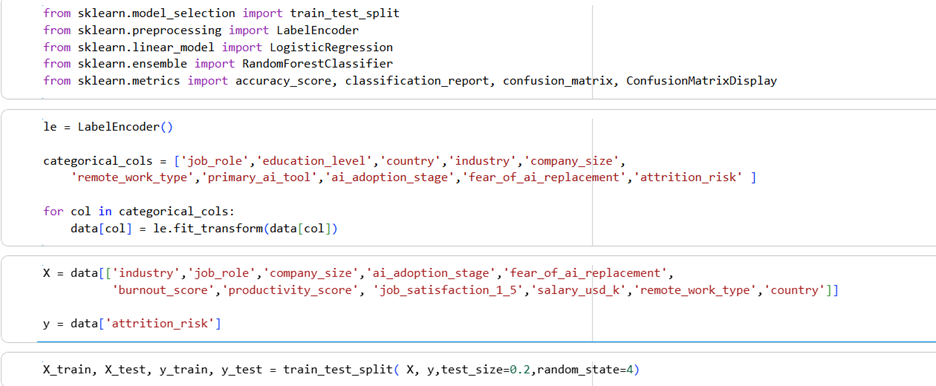

Define Target Column: Sets _attrition_risk_ as the target variable to classify employees into Low, Medium, or High attrition risk categories.

Data Encoding: Converts categorical variables such as job role, industry, company size, remote work type, AI adoption stage, and fear of AI replacement into numerical values using Label Encoding.

Feature Selection: Selects important features including burnout score, productivity score, job satisfaction, salary, industry, company size, country, and AI-related variables for prediction analysis.

Data Splitting: Divides the dataset into training and testing sets using an 80/20 ratio to evaluate model performance effectively.

Model Training: Applies Logistic Regression and Random Forest Classification models to predict employee attrition risk levels.

Model Validation: Evaluates model accuracy and classification performance using accuracy score, confusion matrix, and classification report metrics.

These steps ensured that the dataset was properly prepared, encoded, and optimized for machine learning prediction and employee attrition analysis.

---

### Logistic Regression

Logistic Regression is a classification algorithm used to predict employee attrition risk levels.  
In this project, the model predicts attrition risk based on variables such as burnout score, productivity score, job satisfaction, salary, industry, company size, AI adoption stage, remote work type, fear of AI replacement, country, and job role.

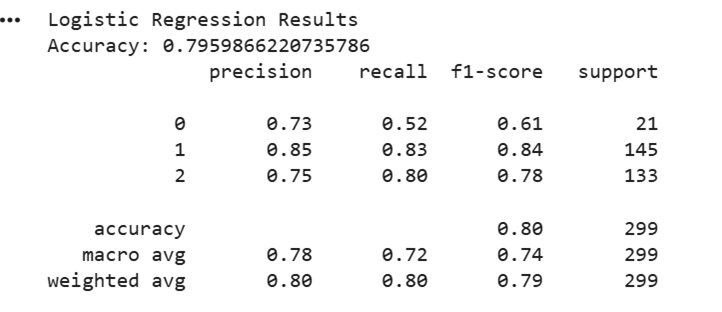
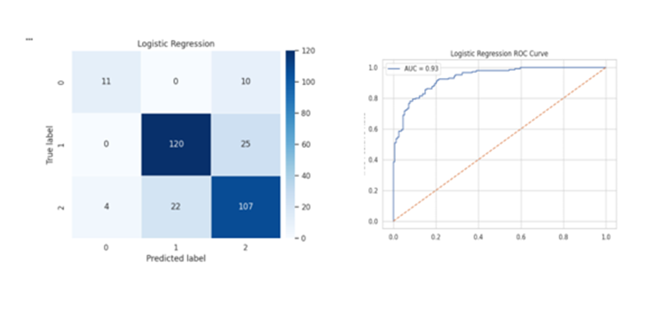

Training Phase

The Logistic Regression model was trained using employee workforce data to learn patterns and relationships between employee characteristics and attrition risk categories (Low, Medium, and High).

Testing Phase

The trained model was tested on unseen employee data to evaluate its prediction performance using classification metrics such as precision, recall, F1-score, confusion matrix, ROC curve, and accuracy.

Model Performance

The Logistic Regression model achieved approximately 80% prediction accuracy.  
The classification report showed strong performance in predicting Medium and High attrition risk employees, with weighted average scores close to 0.80.

The confusion matrix demonstrated that most employee records were classified correctly, especially for Medium and High-risk categories, while a smaller number of Low-risk employees were misclassified.

The ROC Curve achieved an AUC score of 0.93, indicating excellent classification capability and strong separation between attrition risk classes.

Overall Interpretation

Logistic Regression provided clear and interpretable insights into how workforce factors such as burnout, salary, productivity, job satisfaction, and AI-related concerns influence employee attrition risk.

The model successfully identified patterns associated with employee turnover risk and served as an effective baseline model for workforce analytics, employee retention prediction, and HR decision-making.

---

### Random Forest

Random Forest is an ensemble classification algorithm used to predict employee attrition risk by combining multiple decision trees to improve prediction accuracy and reduce overfitting.  
In this project, the model predicts attrition risk based on variables such as burnout score, productivity score, job satisfaction, salary, industry, company size, AI adoption stage, remote work type, fear of AI replacement, country, and job role.

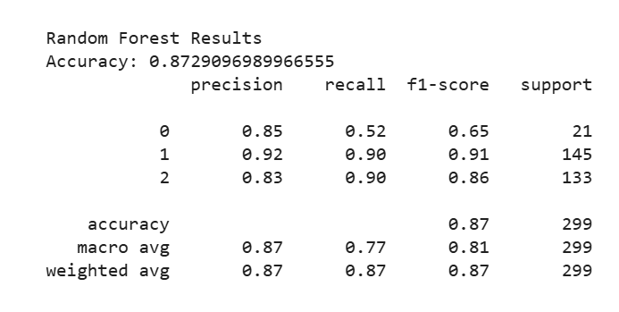
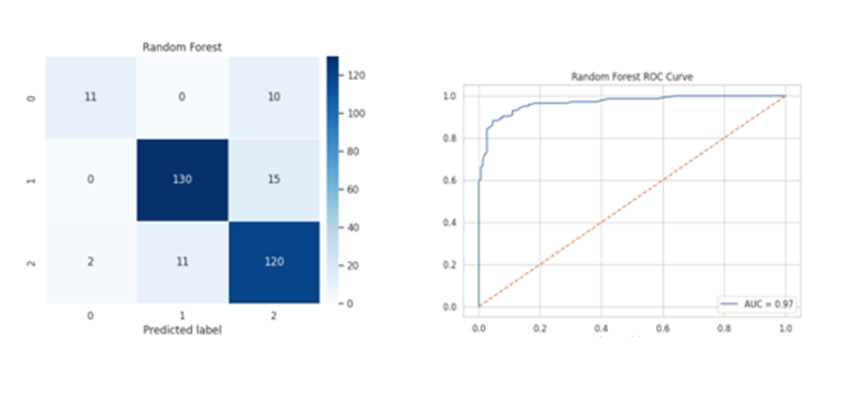

Training Phase

The Random Forest model was trained using employee workforce data to learn complex patterns and relationships between employee characteristics and attrition risk categories (Low, Medium, and High).

Testing Phase

The trained model was tested on unseen employee data to evaluate prediction performance using classification metrics such as precision, recall, F1-score, confusion matrix, ROC curve, and accuracy.

Model Performance

The Random Forest model achieved approximately 87% prediction accuracy, outperforming the Logistic Regression model in overall classification performance.

The classification report showed strong precision, recall, and F1-scores across most attrition categories, especially for Medium and High-risk employees, with weighted average scores reaching approximately 0.87.

The confusion matrix demonstrated that the majority of employee records were classified correctly, particularly for Medium and High attrition risk levels, with fewer misclassification cases compared to Logistic Regression.

The ROC Curve achieved an AUC score of 0.97, indicating excellent predictive capability and very strong separation between attrition risk classes.

Overall Interpretation

Random Forest provided highly accurate and reliable predictions while capturing complex relationships between workforce variables and employee attrition risk.

The model highlighted the strong influence of burnout, job satisfaction, productivity, salary, and AI-related concerns on employee retention behavior.  
Its high predictive performance makes it highly effective for workforce analytics, employee retention strategies, and HR decision-making processes.

---

## Clustering

Clustering is an unsupervised machine learning technique used to group employees with similar workforce and behavioral characteristics without predefined labels.  
In this project, clustering was used to identify employee segments based on:

Job satisfaction, productivity score, burnout score, salary, years of experience, AI task replacement percentage, weekly AI upskilling hours, and daily AI assistance usage.

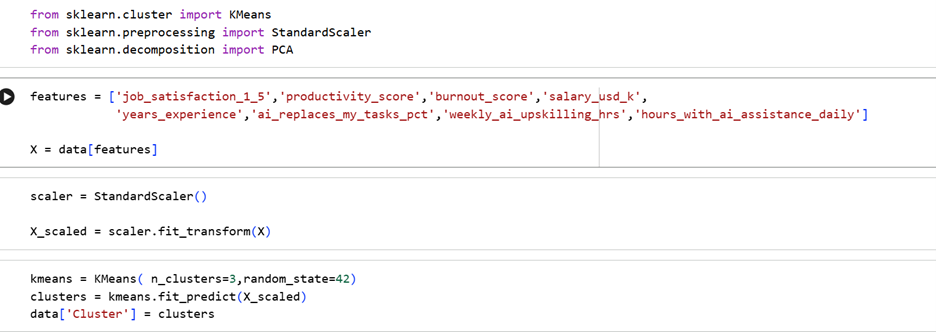

Select Relevant Features: Workforce and AI-related variables associated with employee performance, satisfaction, and attrition behavior were selected for clustering analysis.

Normalize Data: StandardScaler was applied to standardize numerical variables and ensure equal contribution of all features during clustering.

Apply K-Means Clustering: The K-Means algorithm was implemented with 3 clusters to group employees into distinct workforce segments based on similar behavioral and operational patterns.

Assign Cluster Labels: Each employee record was assigned to a cluster group to support segmentation and comparative analysis.

Dimensionality Reduction using PCA: Principal Component Analysis (PCA) was used to reduce feature dimensions and support cluster visualization and interpretation.

Visualize Cluster Results: Cluster distributions and employee group patterns were visualized to identify hidden workforce behaviors and attrition-related trends.

These steps helped identify meaningful employee segments and uncover hidden patterns related to burnout, productivity, AI adoption behavior, and employee satisfaction.

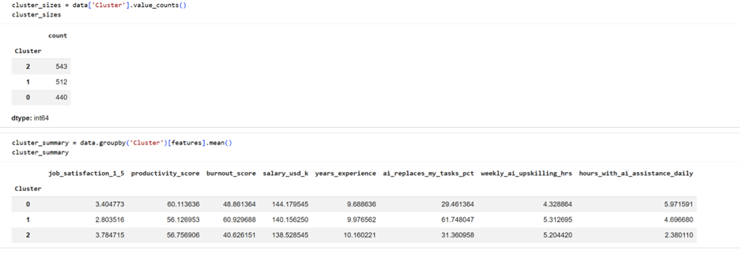

Cluster 0 - High Productivity Balanced Employees

- High productivity score (~60)
- Moderate burnout levels (~49)
- Good job satisfaction (~3.4)
- Highest average salary among clusters
- Moderate AI replacement concern (~29%)
- High daily AI assistance usage
- Moderate AI upskilling hours

This cluster represents employees who are productive, engaged, and effectively using AI tools in their daily work while maintaining relatively balanced burnout levels.

Business Strategy

- Retain these employees through career growth opportunities and leadership programs.
- Continue supporting AI tools that improve productivity.
- Offer performance incentives and recognition programs.
- Monitor burnout levels to prevent future attrition risk.
- Use this group as AI adoption champions within the organization.

Cluster 1 - High Burnout & High AI Fear Employees

- Highest burnout score (~61)
- Lowest job satisfaction (~2.8)
- Lowest productivity among clusters
- Highest AI replacement concern (~62%)
- Highest AI upskilling hours
- Moderate-to-high AI assistance usage

This cluster represents employees experiencing stress, uncertainty, and fear related to AI replacement, leading to lower satisfaction and increased attrition risk.

Business Strategy

- Implement employee wellness and burnout reduction programs.
- Improve communication about AI adoption and job security.
- Provide psychological support and stress management initiatives.
- Focus on employee engagement and retention strategies.
- Offer reskilling programs that position AI as a support tool rather than a replacement threat.
- Managers should closely monitor this group due to higher attrition risk.

Cluster 2 - Satisfied & Low Burnout Employees

- Highest job satisfaction (~3.78)
- Lowest burnout score (~41)
- Stable productivity levels
- Lowest daily AI assistance usage
- Low AI replacement concern (~31%)
- Strong workforce stability

This cluster represents satisfied and stable employees with lower stress levels and healthier work conditions.

Business Strategy

- Maintain current work environment and employee satisfaction practices.
- Encourage gradual AI adoption while preserving work-life balance.
- Use this group as a benchmark for healthy workforce management.
- Provide continuous professional development opportunities.
- Strengthen employee loyalty through long-term retention programs and internal promotions.

Overall Clustering Insights

The clustering analysis revealed clear differences between employee groups:

- One group showed strong productivity and balanced AI usage.
- Another group demonstrated high burnout and fear of AI replacement, making them more vulnerable to attrition.
- A third group represented satisfied and stable employees with lower burnout levels.

These insights help organizations design targeted HR strategies, improve employee retention, reduce burnout, and support successful AI adoption across the workforce.

---

# Tools Research and Selection Effort

Several tools and technologies were used throughout the project to support workforce analytics, machine learning, and dashboard visualization.

Python & Google Colab

Python was used within Google Colab for data preprocessing, machine learning modeling, clustering analysis, evaluation, and visualization.  
Libraries such as Pandas, NumPy, Scikit-learn, Matplotlib, and Seaborn supported tasks such as Logistic Regression, Random Forest, K-Means clustering, PCA, and model evaluation.

Power BI

Power BI was used to create interactive dashboards, KPIs, filters, maps, and workforce analytics visualizations related to attrition risk, burnout, productivity, AI fear, and employee segmentation.

Together, these tools created a complete analytics workflow from data preparation and predictive modeling to interactive business intelligence reporting.

---

# Project Deployment Effort - Use Case

1\. Dashboard Monitoring and Workforce Decision Support

The Power BI dashboards allow management to monitor:

- Employee burnout and productivity
- Attrition risk levels
- AI fear and AI replacement impact
- Employee satisfaction and salary trends

Managers can quickly identify high-risk employees and workforce areas that require attention.

2\. Prediction Models - Employee Attrition Forecasting

The machine learning models help predict employee attrition risk using workforce and AI-related variables.

**Business Uses**

- Identify employees at high attrition risk
- Improve retention strategies
- Support HR decision-making
- Reduce employee turnover costs

The Random Forest model achieved higher prediction accuracy, while Logistic Regression provided more interpretable insights.

3\. Employee Segmentation - Clustering

Clustering was used to group employees based on burnout, satisfaction, productivity, salary, and AI usage.

Business Applications

- Detect high-burnout employee groups
- Improve workforce engagement
- Personalize training and support programs
- Support AI adoption strategies

Overall Business Value

- Dashboards answer: "What is happening?"
- Prediction models answer: "What may happen next?"
- Clustering answers: "Which employee groups should management focus on?"

Together, these approaches improve employee retention, workforce planning, productivity, and HR decision-making.

---

# Results

The project showed that employee attrition and satisfaction are strongly influenced by burnout, productivity, AI replacement concerns, salary, and job satisfaction.

The Random Forest model achieved approximately **87% accuracy**, outperforming Logistic Regression in predicting employee attrition risk.

Clustering analysis identified important employee segments such as:

- High-productivity employees
- High-burnout and high-risk employees
- Satisfied and stable employees

Overall, the project demonstrates how Business Intelligence and AI techniques can transform workforce data into actionable insights that support smarter HR and organizational decisions.

# References

